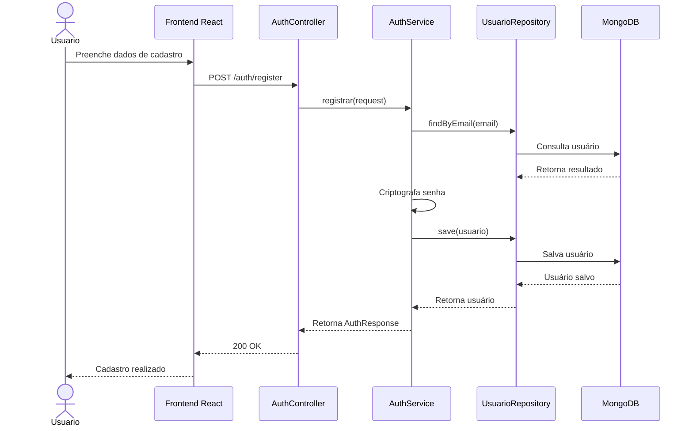
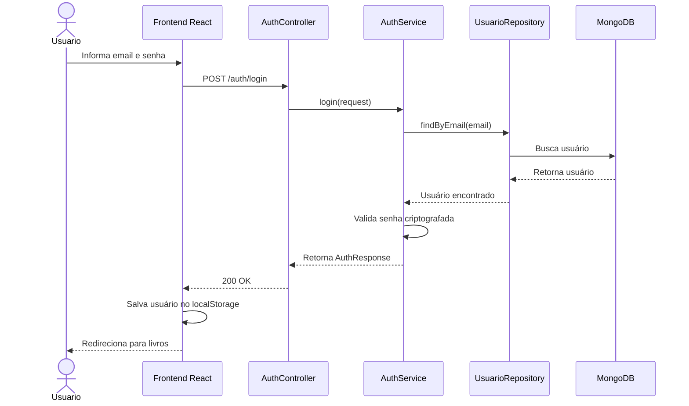
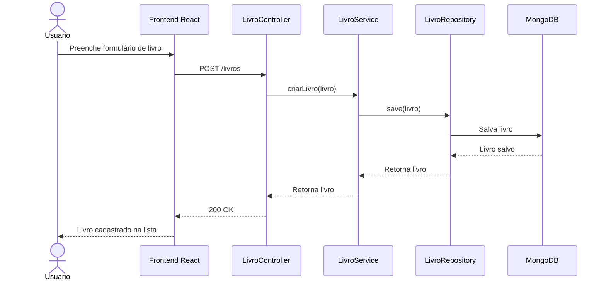
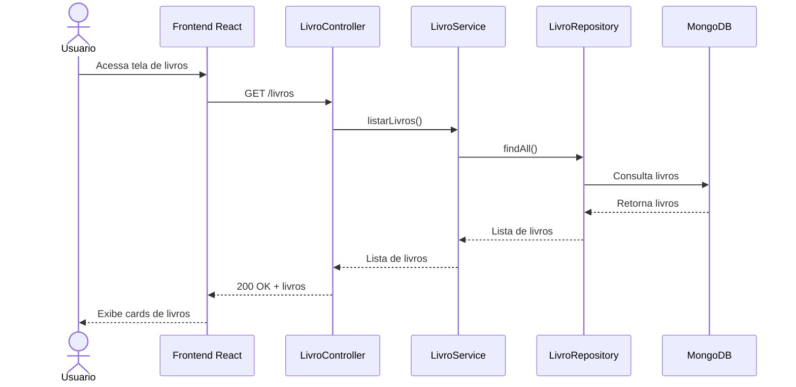
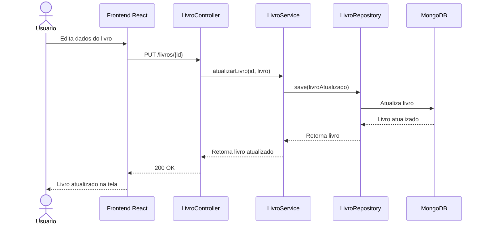
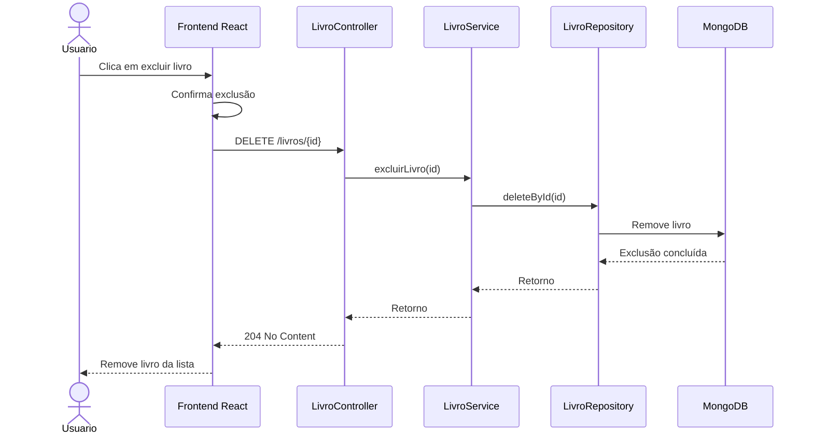

# 📊 Diagramas UML de Sequência - Bookup

Este documento apresenta os principais fluxos do sistema Bookup utilizando diagramas de sequência em Mermaid.

---

## 1. Cadastro de Usuário

---

## 2. Login de Usuário

---

## 3. Cadastro de Livro

---

## 4. Listagem de Livros

---

## 5. Atualização de Livro

---

## 6. Exclusão de Livro

---

# ✅ Observação

Os diagramas representam os principais fluxos de comunicação entre usuário, frontend, backend e banco de dados.